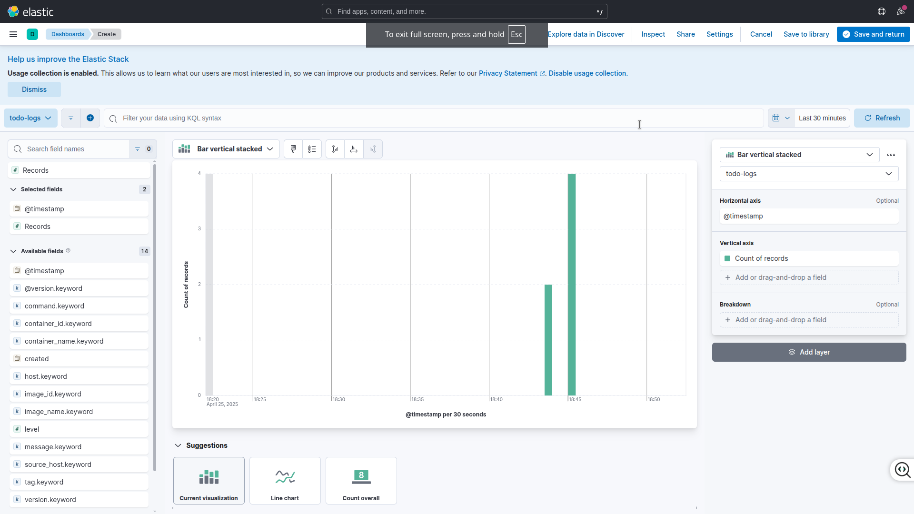
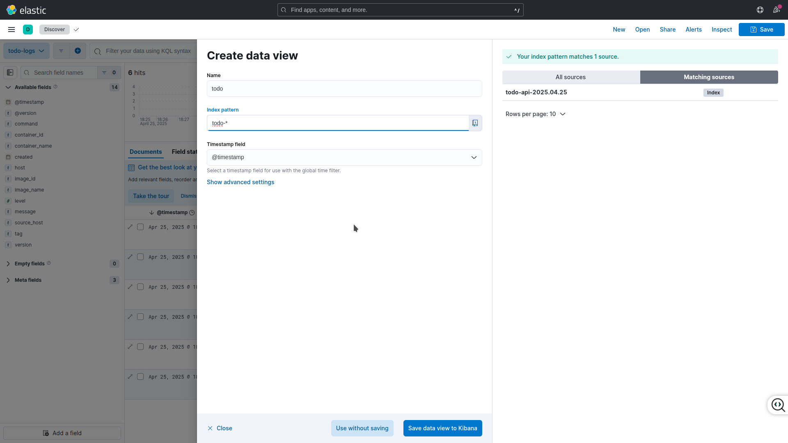
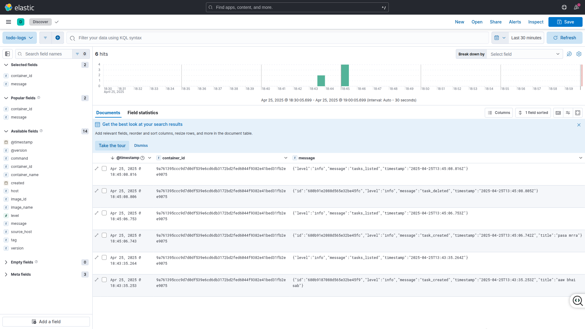

# Todo Stack – NestJS + MongoDB + React + ELK

A minimal full-stack **to-do** application:

* **NestJS / MongoDB** — REST API (`/tasks`)
* **React / Vite** — single-page UI (port 8080)
* **ELK (Elasticsearch + Logstash + Kibana)** — JSON logs for every CRUD action, visualised in Kibana
* Everything ships in one `docker-compose.yml`

---

## 1  Prerequisites

* Docker ≥ 20.10  
* Docker Compose-plugin ≥ 2.20 (`docker compose version`)

---

## 2  Build & Run

```bash
git clone https://github.com/<you>/todo-nestjs-elk.git
cd todo-nestjs-elk
docker compose up --build
```

- API       → http://localhost:3000
- Swagger   → http://localhost:3000/api
- Front-end → http://localhost:8080
- Kibana    → http://localhost:5601 

## 3  Stop & wipe: 
```bash
docker compose down
```

## 4 Why Dockerize each service?

| Service          | Why run in a container?                                                                                         |
|------------------|-----------------------------------------------------------------------------------------------------------------|
| **api (NestJS)** | Guarantees Node 20 runtime + dependencies; identical image across dev, CI/CD, and prod.                         |
| **frontend (React)** | Built once into a slim Nginx image—no Node tool-chain needed on the host.                                     |
| **mongo**        | Instant, version-pinned database; data durability via the `mongo-data` volume.                                  |
| **elasticsearch**| Heavy JVM stack isolated from host; memory capped via `ES_JAVA_OPTS`.                                           |
| **logstash**     | Pipeline config (`logstash/pipeline/*.conf`) shipped as code—easy to reproduce.                                 |
| **kibana**       | Version locked to Elasticsearch; spins up with a single command for reviewers.                                  |

## 5 Kibana dashboard
### Manual access Dashboard
1. Open Kibana → http://localhost:5601
2. Menu Analytics ▸ Dashboard → Create New Dashboard
3. Create New Visualization
   - Select Timestamp in Horizontal Axis 
   - Select Records in Vertical Axis

4. Select Save and Return and Save the dashboard by giving a name

### Manual access Discover logs
1. Open Kibana → http://localhost:5601
2. Menu Analytics ▸ Discover → Create Data View
3. Create New dataview as shown below
   - Give a name to the dataview 
   - select an index pattern from the given ones



## Final Kibana Logs UI
